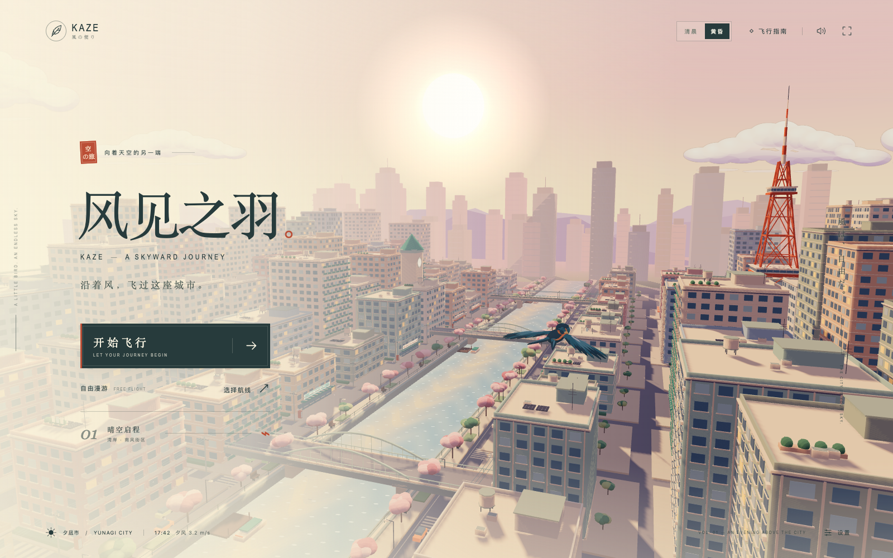

# 风见之羽 · KAZE

[**在线游玩**](https://06wj.github.io/kaze-skyward-journey/) · [源码仓库](https://github.com/06wj/kaze-skyward-journey)



一款第三人称 3D 都市飞行游戏。操作佩戴橙色围巾的燕子，穿过河道、街区与高楼之间的风环；画面采用日式动画方向的阶梯光照、轮廓线与暖色夕照。默认是黄昏，也可切换清晨。

## 玩法

- **开始飞行**：进入旅程模式。通过「选择航线」选择「晴空启程」「天际回响」「暮色逐风」，分别包含 8、10、12 个风环。依序穿环，在时限内抵达终点。
- **自由漫游**：探索同一座城市，没有航线计时终点；碰撞导致状态耗尽后会重新振翅出发。
- 冲刺消耗能量，松开后恢复；穿环补充能量和状态。连续穿环、冲刺穿环、剩余时间与完好程度影响得分。碰撞会损失状态并中断连击。
- 完成航线获得金羽、银羽或铜羽评价。个人最佳成绩与设置保存在当前浏览器的 `localStorage` 中，不跨设备同步。

## 操作

小鸟会自动前飞。

| 操作                   | 键盘            |
| ---------------------- | --------------- |
| 左转 / 右转            | A / D，或 ← / → |
| 抬升 / 下降            | W / S，或 ↑ / ↓ |
| 按住冲刺               | 左 / 右 Shift   |
| 按住减速，缩小转弯半径 | 空格            |
| 暂停 / 继续            | Esc 或 P        |
| 飞行中重试当前航线     | R               |

触屏左下方提供「方向」摇杆，右下方「疾风」按钮可按住冲刺，并可通过界面暂停。手柄使用第一个已连接手柄的左摇杆控制方向，按钮 0 冲刺、按钮 1 减速；具体按键标识取决于设备映射。

通过菜单右下角「设置」或暂停界面的「游戏设置」，调整声音、画面品质、反转升降与减少动态效果。「城市时分」提供「清晨 · 06:28」和「黄昏 · 17:42」，也可通过菜单顶部的「清晨」「黄昏」按钮即时切换。画面品质提供「高品质」和「流畅优先」。减少动态效果会关闭冲刺时的视野扩张。切换到其他标签页或窗口时，游戏自动暂停。音频在开始游戏后的用户交互中启用。

## 本地运行

需要 Node.js **20.19+ 或 22.12+**（符合 Vite 的版本要求）和支持 WebGL 2、WebAssembly、Web Audio 的浏览器。

```sh
npm ci
npm run dev
```

打开终端显示的本地地址。项目使用 Three.js、TypeScript、Vite 与 Rapier，无需配置服务端或 API 密钥。

```sh
npm test          # 飞行、穿环、冲刺、受伤与碰撞逻辑检查
npm run build    # TypeScript 检查并生成 dist/
npm run preview  # 本地检查生产构建
```

浏览器检查脚本位于 `scripts/`。在本机启动开发服务器和预览服务器后，可执行 `node scripts/playthrough.mjs` 或 `node scripts/release-smoke.mjs`。macOS 会优先使用已安装的 Chrome；其他环境先运行 `npx playwright install chromium`，也可设置 `CHROME_PATH` 指定浏览器。`DEV_URL` 和 `PREVIEW_URL` 可覆盖默认本地地址。

## GitHub Pages 与静态发布

在线地址：**https://06wj.github.io/kaze-skyward-journey/**

`.github/workflows/deploy.yml` 会在推送到 `main` 后自动安装依赖、运行测试、构建并部署到 GitHub Pages。Pull Request 运行相同的测试与构建，但不发布。

Pages 构建使用项目子路径，JS、CSS、图标与 GLB 模型均随之解析：

```sh
npm run build -- --base /kaze-skyward-journey/
```

如复制仓库并更改名称，请同步修改工作流中的 `--base`。仓库 Settings → Pages 的发布来源应为 **GitHub Actions**。

部署到其他静态站点根路径时，执行普通 `npm run build`，再上传 `dist/` 内的全部文件，包括 `assets/` 和 `models/`。请通过 HTTP / HTTPS 访问，不要直接双击 `index.html`。

浏览器与移动设备的发布验收应在目标设备上进行，不能用单元测试替代；当前检查范围见 [验证记录](artifacts/QA.md)。

## 项目与资源

| 位置                           | 内容                             |
| ------------------------------ | -------------------------------- |
| `src/simulation/`              | 飞行、航线、计分、输入与本地成绩 |
| `src/physics/`                 | Rapier 扫掠球体碰撞检测          |
| `src/render/`                  | 城市、天空、小鸟与飞行特效       |
| `src/ui/`                      | 菜单、HUD、设置与触屏界面        |
| `src/audio/`                   | Web Audio 合成风声、旋律和反馈音 |
| `public/models/swallow.glb`    | 游戏运行时燕子模型               |
| `assets/blender/swallow.blend` | 可编辑 Blender 源文件            |
| `scripts/create-bird.py`       | 原创燕子的程序建模与导出脚本     |

模型通过 Blender 5.1.2 构建。可在独立后台进程中重新生成：

```sh
blender --background --python scripts/create-bird.py
```

脚本输出 GLB、`.blend` 源文件及预览图；会覆盖这三个生成文件。模型在游戏中使用 Y 向上、−Z 向前的坐标，羽翼、燕尾和围巾有独立动画节点。资源来源及第三方依赖许可见 [LICENSE-ART.md](LICENSE-ART.md)。
